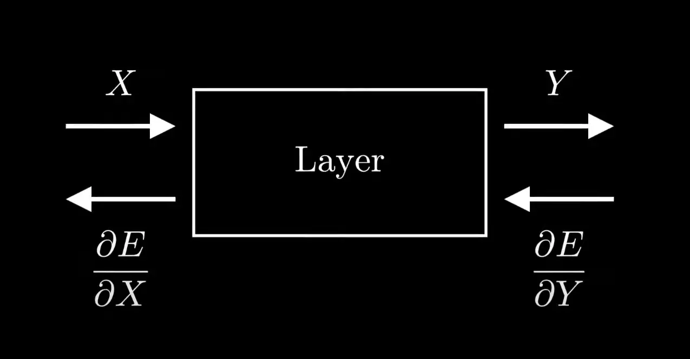

<h1 align='center'> 🧠 multilayer-perceptron</h1>

> ⚠️ This tutorial assumes you have done [dslr](https://github.com/leogaudin/dslr) and that you have a good understanding of the basics of machine learning and linear algebra.

## Table of Contents

- [Introduction](#introduction) 👋
- [Layers](#layers) 📚
    - [Dense](#dense)
    - [Activation](#activation)
- [Forward Propagation](#forward-propagation) ➡️
- [Backward Propagation](#backward-propagation) 🔙
    - [Softmax + cross-entropy loss](#softmax--cross-entropy-loss)
    - [Activation layers](#activation-layers)
        - [Sigmoid](#sigmoid)
        - [ReLU](#relu)
    - [Dense layers](#dense-layers)
    - [Putting it all together](#putting-it-all-together)
- [Resources](#resources) 📖
<!-- - [Losses](#losses) 📉
- [Optimizers](#optimizers) 🚀 -->

## Introduction

`multilayer-perceptron` gives us a problem to solve that is fairly similar to the one we had in `dslr`, if not simpler: we are given a dataset of fine-needle aspirates of breast mass, and we have to predict whether the mass is benign or malignant.

The project is not really about the dataset, but rather about the implementation of a neural network, and how modular it is. Here, we will cover the various "modules" of the neural network, and how they interact with each other.

> 💡 I recommend you watch *sentdex*'s [Neural Networks from Scratch](https://www.youtube.com/playlist?list=PLQVvvaa0QuDcjD5BAw2DxE6OF2tius3V3) first, as it provides great explanations on each component of a NN and their respective roles.

## Layers

A neural network is made of layers, and layers are made of neurons, which are the basic unit of computation in a neural network.

A layer is characterized by its input and output sizes (e.g. 4 neurons in, 3 neurons out), along with its weights and biases.

The weights and biases are the parameters of the layer, and they are what the neural network will tweak during its training.

There are several types of layers, but we will explain only two of them here.

### Dense

A **dense** layer, or **fully connected** layer, is a type of layer where each neuron is connected to each neuron in the previous layer.

Each weight in the layer is associated with a connection between two neurons (i.e. what impact will the output of neuron $i$ have on neuron $j$).

### Activation

Activations are actually functions, as they do not depend on any external weight but only on the output of the neurons. However, we will treat them as some kind of intermiediate layer here, as it will be more relevant when we get to forward and back propagation.

In `dslr`, our activation function was the **sigmoid** function, which squashes the output of the neuron between 0 and 1.

It is now considered a bit old-fashioned, so you would rather use the **ReLU** function, which is much simpler and faster to compute.

> 💡 The ReLU function is defined as $f(x) = \max(0, x)$. Simpler than $\frac{1}{1 + e^{-x}}$ to be honest.

## Forward Propagation

Forward propagation is the simple process of passing an input through the layers of the neural network.

You pass an input to the input layer, that will pass it to a hidden layer that will compute an output, passed to an activation layer, passed to another hidden layer, and so on, until you reach the output layer.

The output layer will then give the prediction of the neural network.

Simple.

## Backward Propagation

With forward propagation, we now have a prediction. However, we need to know how good this prediction is, and how we can improve it.

In `dslr`, we directly calculated the derivative of the loss w.r.t. the weights and biases, and updated them accordingly, because each weight had a direct impact on the output.

However, in a neural network with multiple layers, the weights of the first layer have an indirect impact on the output, and it gets trickier to derive.

That is where **backpropagation** and the **chain rule** come in.

We basically decompose the task of computing the derivatives per layer, and pass them sequentially from the output layer to the input layer.

That is to say, each element will need to implement the derivative of its output error w.r.t. its input, formally $\frac{\partial E}{\partial X}$, based on the derivative of the error w.r.t. its output, $\frac{\partial E}{\partial Y}$.

  

> *Forward and backward propagation visualized for one layer.*
>
> 💡 Back propagation is one of the hardest concepts of this project, so be sure to check out the resources, particularly [this video](https://www.youtube.com/watch?v=pauPCy_s0Ok) that decomposes the problem amazingly, also available as  [an article](https://towardsdatascience.com/math-neural-network-from-scratch-in-python-d6da9f29ce65).

Naturally, the first derivative we will need to compute is the derivative of the loss w.r.t. the output of the neural network.

Here, the network's output passes through a **softmax** function, which turns a vector of raw scores into a vector of probabilities (e.g. $[0.1, 0.2, 0.7]$).

Then, it is passed to a **cross-entropy** loss function, which computes the difference between the predicted probabilities and the actual probabilities (e.g. the actual result was $[0, 0, 1]$).

The derivative of the cross-entropy loss w.r.t. its input is quite tricky, and the softmax function is even trickier.

However, the derivative of the **softmax function + cross-entropy loss** is quite simple, and is given by the formula $Y_{pred} - Y_{true}$. You can find the full derivation [here](https://www.pinecone.io/learn/cross-entropy-loss/#Derivative-of-the-Softmax-Cross-Entropy-Loss-Function).

> 💡 Capital letters denote vectors, and normal letters are scalars. $Y$ is a vector $[y_1, y_2, y_3]$ for example.

We will now see how to compute $\frac{\partial E}{\partial X}$ for each layer.

In the following, we will call $\frac{\partial E}{\partial Y}$ the **output gradient** of the layer.

> ⚠️ Here, all the derivatives are given already reduced, but you should watch the whole process of deriving them in [this video](https://www.youtube.com/watch?v=pauPCy_s0Ok) mentioned above.

### Softmax + cross-entropy loss

We just saw that the derivative of the softmax + cross-entropy loss is $Y_{pred} - Y_{true}$.

### Activation layers

The derivative of activation layers is given by its output gradient, multiplied element-wise by the derivative of the activation function used.

$$
\frac{\partial E}{\partial X} = \frac{\partial E}{\partial Y} \odot f'(X)
$$

Let's see some derivatives $f'(x)$ for common activation functions.

#### Sigmoid

The derivative of the sigmoid function is given by:

$$
f'(x) = x (1 - x)
$$

> 💡 Here for instance, $\frac{\partial E}{\partial X} = \frac{\partial E}{\partial Y} \odot x (1 - x)$.

#### ReLU

The derivative of the ReLU function is quite simple:

$$
f'(x) = \begin{cases}
1 & \text{if } x > 0 \\
0 & \text{otherwise}
\end{cases}
$$

### Dense layers

Dense layers are a bit more complex, because aside from computing the input gradient based on the output gradient, **we also need to compute the weights and biases gradients in order to update them**.

Here, we assume the weights are a matrix of shape $(n, m)$, where $n$ is the number of neurons in the previous layer, and $m$ is the number of neurons in the current layer. That is to say, it takes an input of size $n$ and outputs a vector of size $m$.

The input gradient is given by:

$$
\frac{\partial E}{\partial X} = \frac{\partial E}{\partial Y} \cdot W^T
$$

The weights gradient is given by:

$$
\frac{\partial E}{\partial W} = X^T \cdot \frac{\partial E}{\partial Y}
$$

The biases gradient is simply the output gradient $\frac{\partial E}{\partial Y}$. Note that in the case of batch-GD, you will need to sum the gradients over the batch dimension.

### Putting it all together

Now, let's take the following neural network:

- Input layer of size 4
- ReLU activation layer
- Hidden layer of size 3
- ReLU activation layer
- Output layer of size 2
- Softmax activation layer

During a single epoch, backpropagation will look like this:

1. Compute the output of the neural network and pass it through softmax to get $Y_{pred}$.
2. Compute the loss gradient $Y_{pred} - Y_{true}$.
3. Pass it to the output layer to get the gradient of its loss w.r.t. its input.
4. Pass this gradient to the ReLU activation layer to get the gradient of its loss w.r.t. its input.
5. Pass this gradient to the hidden layer to get the gradient of its loss w.r.t. its input, and allow it to update its weights and biases.
6. And so on, until we reach the input layer.

> 💡 You might end up fighting with NumPy's broadcasting when working with batches. Do not sum or average the batches without reason. You should be able to implement this without doing any other sum than the biases update's.

## Resources

- [📺 YouTube − Neural Networks from Scratch](https://www.youtube.com/playlist?list=PLQVvvaa0QuDcjD5BAw2DxE6OF2tius3V3) : understand the various components of a neural network and how to create one in a modular way.
- [📺 YouTube − Backpropagation, step-by-step | DL3](https://www.youtube.com/watch?v=Ilg3gGewQ5U) : understand how backpropagation works.
- [📺 YouTube − Backpropagation calculus | DL4](https://www.youtube.com/watch?v=tIeHLnjs5U8) : understand the math behind backpropagation.
- [📺 YouTube − Backpropagation Algorithm | Neural Networks](https://www.youtube.com/watch?v=sIX_9n-1UbM) : have a good insight of the chain rule's logic in backpropagation.
- [📺 YouTube − Neural Network from Scratch | Mathematics & Python Code](https://www.youtube.com/watch?v=pauPCy_s0Ok) : understand the actual implementation of backpropagation in code.
- [📖 Medium − Neural Network from scratch in Python](https://towardsdatascience.com/math-neural-network-from-scratch-in-python-d6da9f29ce65) : the corresponding article to the previous video.
- [📖 Pinecone − Cross-Entropy Loss: make predictions with confidence](https://www.pinecone.io/learn/cross-entropy-loss/#Derivative-of-the-Softmax-Cross-Entropy-Loss-Function) : the full derivation of the softmax + cross-entropy loss.

- [💬 ]()
